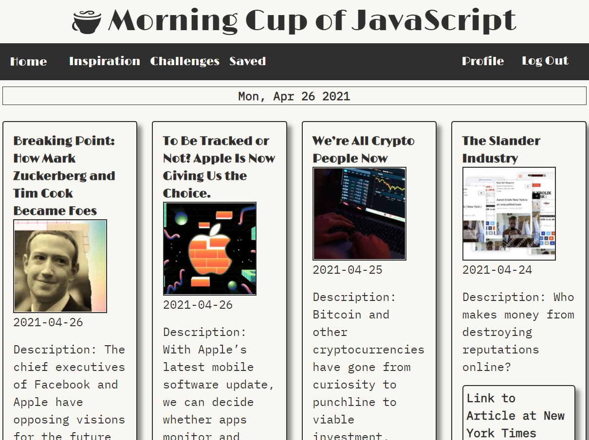
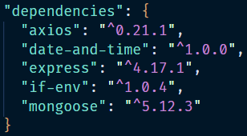
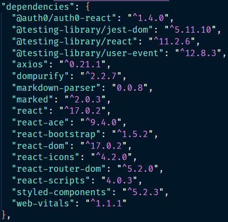

# Morning Cup of JavaScript

 

---

## Links

App deployed link on Heroku

https://secure-wave-92624.herokuapp.com/

App GitHub repository 

https://github.com/Oliviapark113/morning_cup_of_javascript

 

---

## Description

A full stack MERN application that caters to the JavaScript enthuiasts who are looking for an all-in-one website. Users have access to tech news, coding challenges, and a project inspiration generator. 

 

---

## Table of Contents

[Links](#links)

[Description](#description)

[Tech](#tech)

[Usage](#usage)

[Features](#features)

[Future Development](#future-development)

[License](#license)

[Contributors](#contributors)

[Credits](#credits)

[Create React App](#create-react-app)

 

---

## Tech

MERN:

* <a href="https://www.mongodb.com/">MongoDB</a>

* <a href="https://expressjs.com/">Express.js</a>

* <a href="https://reactjs.org/">React.js</a>

* <a href="https://nodejs.org/en/">Node.js</a>

APIs:

* <a href="https://developer.nytimes.com/docs/top-stories-product/1/overview">NY Times Api</a>

* <a href="https://dev.codewars.com/#code-challenges-api">Codewars Api</a>

* <a href="https://api-docs.npms.io/">npms Api</a>

Authentication:

* <a href="https://auth0.com/">Auth0</a>

NPM:

* **main folder** package.json

* **client folder** package.json

 

---

## Usage

1. Go to the deployed app website

    https://secure-wave-92624.herokuapp.com/

2. Click &nbsp;`Sign Up` **Button**

    **This will redirect you to the Auth0 sign up page*

4. Click &nbsp;`Log In` **Button** for returning visits to the site

5. Click any of the **Links** in the **Navbar** to navigate through the different pages of the site

    **For smaller screens the **Navbar** is minimized to a dropdown menu*

    Click the &nbsp; &nbsp;**Button** to reveal the page **Links**

6. Click &nbsp;`Log Out` **Button** to change users

 

---

## Features

1. **Home**

    * Get the latest tech news for the day from the **NY Times** top stories

    * **Description** summary of each article

    * Click `Link To Article At New York Times` **Button** to read the full article.

2. **Inspiration**

    * Randomly generates a **List** of inspiration for a project or a to challenge yourself. 

    * Toggle which of the **3** category **buttons** will be included in your inspiration at the top of the page. 

        * `npm`
        * `api`
        * `framework`

    * **Comment Section** for users to leave comments about projects they've made with the inspiration generator and connect with other users in our community.

        * All users can **edit** and **delete** their own comments.

3. **Challenges**

    * List of coding challenges that users can attempt to complete to keep their skills sharp

    * **EASY** (green) and **HARD** (red) challenges are color coded

    * Click the `Challenge` **Button** to be taken to the individual **Challenge Page**

        * **Type** out your code in the **Code Block** provided for you.

        * Click the `SAVE` **Button** to save your code block

        **Redirects you to the **Saved** page*

        * Click the `CodeWarsLink` **Button** to try out your code on their website to see if it is correct

    * Click the `Link` **Button** to be taken to the Codewars website for the specific challenge

4. **Saved**

    * List of all your saved **Code Block** answers to the code challenges

    * Click the `Challenge` **Button** to see the individual code challenge **Saved Answer**

        * Adjust your code if you wish in the **Code Block**

        * Click the `UPDATE` **Button** to save your updated code

5. **Profile**

    * Shows the logged in user's **email**

 

---

## Future Development

* Add a joke page with programming themed jokes, memes, and gifs

* Upload image for profile picture

* Run your saved code blocks to see if you are getting the desired results without having to leave our site

* More code challenges

* More apis and frameworks for the inspiration generator

* Like button for challenges and ability to filter by most liked challenges

## License

This application falls under the MIT license

 

---

## Credits

Special thanks to Josh and the gang! Nick and  Sebastian thanks for the tips and tricks!

https://reactjs.org/docs/getting-started.html

https://mongoosejs.com/docs/

https://auth0.com/

https://www.youtube.com/watch?v=1rgeO_EbSGg&list=PLZ14qQz3cfJL6aoKZ_Ly7jiYrwi9ihviW&t=1s

https://developer.nytimes.com/docs/top-stories-product/1/overview

https://api-docs.npms.io/

https://dev.codewars.com/#code-challenges-api

 

---

## Contributors

<a href="https://github.com/Oliviapark113">Olivia Park</a>

<a href="https://github.com/Pete-Scale">Pete Scale</a>

<a href="https://github.com/Nvrtis/Nvrtis.github.io">Nicholas Vrtis</a>

<a href="https://github.com/Geoff7709">Geoffrey Zimmerman</a>

 

---

## Create React App

This project was bootstrapped with [Create React App](https://github.com/facebook/create-react-app).

### Available Scripts

In the project directory, you can run:

#### `npm start`

Runs the app in the development mode.\
Open [http://localhost:3000](http://localhost:3000) to view it in the browser.

The page will reload if you make edits.\
You will also see any lint errors in the console.

#### `npm test`

Launches the test runner in the interactive watch mode.\
See the section about [running tests](https://facebook.github.io/create-react-app/docs/running-tests) for more information.

#### `npm run build`

Builds the app for production to the `build` folder.\
It correctly bundles React in production mode and optimizes the build for the best performance.

The build is minified and the filenames include the hashes.\
Your app is ready to be deployed!

See the section about [deployment](https://facebook.github.io/create-react-app/docs/deployment) for more information.

#### `npm run eject`

**Note: this is a one-way operation. Once you `eject`, you can’t go back!**

If you aren’t satisfied with the build tool and configuration choices, you can `eject` at any time. This command will remove the single build dependency from your project.

Instead, it will copy all the configuration files and the transitive dependencies (webpack, Babel, ESLint, etc) right into your project so you have full control over them. All of the commands except `eject` will still work, but they will point to the copied scripts so you can tweak them. At this point you’re on your own.

You don’t have to ever use `eject`. The curated feature set is suitable for small and middle deployments, and you shouldn’t feel obligated to use this feature. However we understand that this tool wouldn’t be useful if you couldn’t customize it when you are ready for it.

### Learn More

You can learn more in the [Create React App documentation](https://facebook.github.io/create-react-app/docs/getting-started).

To learn React, check out the [React documentation](https://reactjs.org/).

#### Code Splitting

This section has moved here: [https://facebook.github.io/create-react-app/docs/code-splitting](https://facebook.github.io/create-react-app/docs/code-splitting)

#### Analyzing the Bundle Size

This section has moved here: [https://facebook.github.io/create-react-app/docs/analyzing-the-bundle-size](https://facebook.github.io/create-react-app/docs/analyzing-the-bundle-size)

#### Making a Progressive Web App

This section has moved here: [https://facebook.github.io/create-react-app/docs/making-a-progressive-web-app](https://facebook.github.io/create-react-app/docs/making-a-progressive-web-app)

#### Advanced Configuration

This section has moved here: [https://facebook.github.io/create-react-app/docs/advanced-configuration](https://facebook.github.io/create-react-app/docs/advanced-configuration)

#### Deployment

This section has moved here: [https://facebook.github.io/create-react-app/docs/deployment](https://facebook.github.io/create-react-app/docs/deployment)

#### `npm run build` fails to minify

This section has moved here: [https://facebook.github.io/create-react-app/docs/troubleshooting#npm-run-build-fails-to-minify](https://facebook.github.io/create-react-app/docs/troubleshooting#npm-run-build-fails-to-minify)
